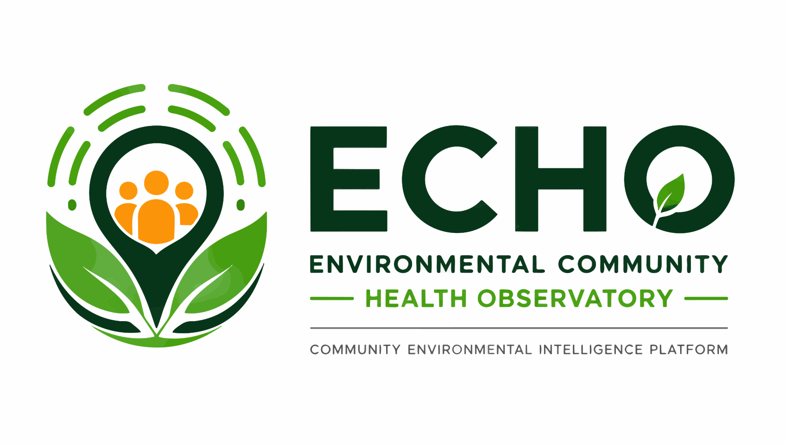

# 🌍 ECHO – Environmental Community Health Observatory



> **Empowering communities through environmental intelligence, citizen participation, artificial intelligence, and real-time data.**

ECHO (Environmental Community Health Observatory) is an AI-powered Environmental Intelligence Platform built for citizens, communities, and government agencies — starting in Nasarawa State, Nigeria — to collaboratively report, monitor, analyze, and respond to environmental and public health challenges.

The platform combines **AI-powered hazard assessment**, **community-driven reporting**, **interactive GIS mapping**, **real-time analytics**, and **data visualization** to promote cleaner, safer, and healthier communities.

---

# 🚀 Vision

To become the leading digital platform that enables communities and governments to make informed environmental decisions through technology, data, and collaboration.

---

# 🎯 Mission

ECHO empowers people to:

- Report environmental hazards quickly
- Monitor environmental conditions
- Participate in community cleanup initiatives
- Receive real-time notifications and alerts
- Access AI-generated environmental intelligence
- Promote healthier and more sustainable communities

---

# ✨ Core Features

## 🤖 AI Environmental Intelligence

- Every hazard report is sent to a Supabase Edge Function that calls Google Gemini
- Returns a structured assessment: severity (Low/Medium/High/Critical), a 0–1 risk score, priority, likely impact, and a short summary
- Surfaced automatically in both the citizen and admin report views — no manual triage required

---

## 🗺️ Interactive GIS Mapping

- Leaflet-based interactive map with marker clustering
- Hazard report and cleanup event visualization
- Geographic clustering of incidents
- Hotspot-style density visualization

---

## 🚨 Hazard Reporting

Users can report:

- Illegal dumping
- Flooding
- Air pollution
- Water pollution
- Noise pollution
- Waste accumulation
- Environmental emergencies
- Public health concerns

Reports include:

- Photos
- GPS location
- Category
- Description
- AI-assessed severity/risk/priority
- Status tracking through an activity log, from submission to resolution

---

## 🧹 Cleanup Events

Organize and manage community cleanup campaigns.

Features include:

- Upcoming events
- Event registration
- Attendance/registration counts
- Admin event creation and editing
- Interactive event maps

---

## 👥 Community & Insights

A dedicated space for community engagement, including:

- Community Insights page
- Environmental campaigns and local initiatives context
- Community health scoring

---

## 📊 Analytics Dashboard

Interactive dashboards (citizen and admin) built on Recharts and Supabase RPCs, displaying:

- Environmental statistics
- Community reports and trends
- Active incidents
- Community health scores
- Platform-wide stats on the public landing page

---

## 🔔 Notifications

Real-time notifications for:

- Report status updates
- Cleanup events
- Admin broadcast announcements
- System updates

---

## 🎁 Rewards System

Encourages community participation through:

- Points
- Achievements
- Badges
- Leaderboards

---

## 📚 Knowledge Centre

Admin-authored educational resources covering:

- Environmental awareness
- Recycling
- Climate change
- Public health
- Sustainability
- Community best practices

Includes a public reading view and slug-based article pages.

---

## 🔍 Global Search

Cross-entity search across reports, knowledge articles, and events via a dedicated Supabase RPC.

---

## 👤 User Profiles

Users can:

- Manage personal information
- View contribution history
- Track rewards
- Monitor their reports
- Update settings and preferences

---

## 🔐 Admin Panel

A dedicated, role-gated admin shell for:

- Reviewing and verifying reports (pre-sorted by AI-assessed priority)
- Managing knowledge articles, events, FAQs
- Sending broadcast notifications
- Viewing platform-wide overview stats

---

# 📱 Responsive Design

Optimized for:

- 📱 Android
- 📱 iPhone
- 💻 Desktop
- 💻 Laptop
- 📱 Tablets

Responsive layouts ensure consistent performance across all supported devices, including safe-area handling for mobile notches and a dedicated bottom nav on small screens.

---

# 🛠 Technology Stack

### Frontend

- React 19
- TypeScript
- Vite 5
- Tailwind CSS v4
- shadcn/ui (Radix primitives)
- Framer Motion
- React Router v7 (route-based code splitting)
- Lucide Icons
- Leaflet / React-Leaflet (+ marker clustering)
- Recharts
- React Hook Form + Zod

### Backend

- Supabase

Including:

- Authentication
- PostgreSQL Database
- Row Level Security (RLS)
- Storage
- Realtime
- Edge Functions (Deno) — AI hazard assessment via Gemini

### Tooling

- Bun (primary package manager) — npm also supported
- ESLint + TypeScript for linting/type-checking

---

# 🔐 Authentication

ECHO supports secure authentication using Supabase.

Features include:

- Email & Password Sign In
- User Registration
- Password Reset
- Protected Routes
- Role-based Access (RLS) — citizen vs. administrator

---

# 🗄 Database

The platform utilizes Supabase PostgreSQL, managed through 20 migrations covering schema, RLS policies, triggers, and RPCs.

Core tables and areas include:

- Hazard Reports (+ report drafts, activities, AI verification fields)
- Notifications (incl. admin broadcast)
- User Stats / Rewards
- Cleanup Events + Event Registrations
- FAQs
- Storage buckets for report photos and media
- Public landing stats & global search support

Additional tables may be added as the platform evolves.

---

# 🎨 UI/UX Highlights

- Premium modern interface
- Responsive layouts across mobile, tablet, and desktop
- Smooth, reduced-motion-aware animations (Framer Motion)
- AI-inspired design language
- Interactive dashboards
- Accessible components (shadcn/ui + Radix)

---

# ⚡ Performance

The application is optimized for:

- Fast rendering via route-based code splitting (`React.lazy`)
- Responsive layouts with no horizontal-scroll/CLS issues
- Mobile performance (safe-area padding, sticky headers)
- Accessibility
- Lazy-loaded images and optimized assets

---

# 📂 Project Structure

```text
src/
├── App.tsx                # Route table (public, auth, citizen, intelligence, community, admin)
├── main.tsx
├── layouts/                # MainLayout, DashboardLayout, AdminLayout, AdaptiveLayout
├── pages/
│   ├── public/             # Landing, About, Contact, FAQ, NotFound
│   ├── auth/                # Login, Register, ForgotPassword, ResetPassword
│   ├── citizen/             # Dashboard, ReportHazard, TrackReports, ReportDetails,
│   │                        #   Notifications, Rewards, Profile, Settings
│   ├── intelligence/        # AI Intelligence, Analytics, Interactive Map,
│   │                        #   Community Health, Global Search
│   ├── community/           # Knowledge Centre, Article Details, Cleanup Events,
│   │                        #   Community Insights
│   ├── admin/                # Overview, Reports, Knowledge editor, Events editor,
│   │                        #   FAQs, Notifications, "coming soon" stubs
│   └── legal/                # Privacy Policy, Terms, Cookie Policy, Accessibility
├── components/               # Mirrors the page groups above (landing, dashboard,
│                              #   reports, events, rewards, admin, ai, verification,
│                              #   notifications, profile, community, intelligence, ui)
├── hooks/                    # use-auth, use-geolocation, use-events,
│                              #   use-reports-store, use-notifications, use-intelligence-data …
├── integrations/              # Supabase client
├── lib/                        # storage-upload, image-compression, impact-constants,
│                              #   fallback-articles, share-utils, status-colors, utils
└── types/

supabase/
├── functions/
│   └── generate-report-assessment/   # Edge function: AI severity/risk scoring (Gemini)
└── migrations/                        # 20 migrations — schema, RLS, triggers, RPCs
```

---

# 🚀 Getting Started

## Clone the repository

```bash
git clone <your-repo-url>
```

## Navigate to the project

```bash
cd ECHO-PLATFORM
```

## Install dependencies

Using Bun (recommended)

```bash
bun install
```

Or npm

```bash
npm install
```

---

## Configure Environment Variables

Copy:

```text
.env.example
```

to

```text
.env
```

Then update:

```env
VITE_SUPABASE_URL=https://YOUR-PROJECT-REF.supabase.co
VITE_SUPABASE_PUBLISHABLE_KEY=YOUR_PUBLISHABLE_ANON_KEY
```

Never put the Supabase **service-role** key here — it must stay server-side only.

---

## Apply Database Migrations

Run the SQL files in `supabase/migrations/` against your Supabase project (via the Supabase CLI or SQL editor), in order, to set up tables, RLS policies, triggers, and RPCs.

---

## Start Development

```bash
bun run dev
```

or

```bash
npm run dev
```

The dev server runs at `http://localhost:8080`.

---

## Build Production

```bash
bun run build
```

or

```bash
npm run build
```

---

## Preview Production

```bash
bun run preview
```

or

```bash
npm run preview
```

---

## Other Scripts

```bash
bun run build:dev   # development-mode build
bun run typecheck   # tsc --noEmit
bun run lint         # eslint .
```

---

# 🔒 Security

- Environment variables are excluded from version control.
- Row Level Security (RLS) protects user data at the database layer.
- Authentication is handled securely through Supabase.
- Admin routes are protected both client-side (route guards) and server-side (RLS).
- Sensitive credentials (service-role key) are never committed to the repository.

---

# 🧪 Project Status

**Actively developed.**

Recent work has focused on stabilizing animations, fixing routing/link consistency, hardening the AI assessment pipeline, and adding platform-wide stats, global search, and an expanded impact-tracking framework.

Future roadmap includes:

- Expanded AI-powered environmental forecasting
- IoT sensor integration
- Satellite imagery
- Advanced GIS analytics
- Deeper government administration tooling
- Offline reporting
- Progressive Web App (PWA)
- Multi-language support

---

# 🤝 Contributing

Contributions, feature requests, and bug reports are welcome.

Please open an issue or submit a pull request for improvements.

---

# 📄 License

This project is licensed under the MIT License unless otherwise specified.

---

# 👨‍💻 Developed By

**Furutan Lawrence Samuel**

Environmental Community Health Observatory (ECHO)

Building technology for cleaner, healthier, and smarter communities.

---

⭐ If you found this project interesting, consider giving it a star on GitHub!

